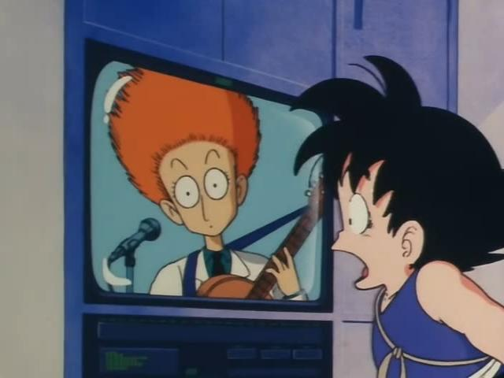
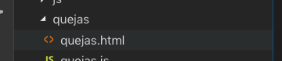
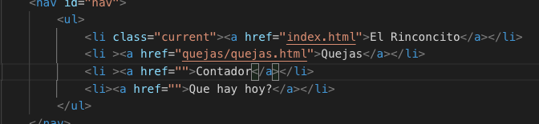
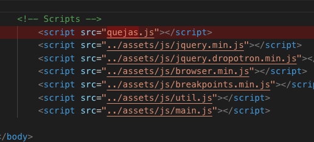
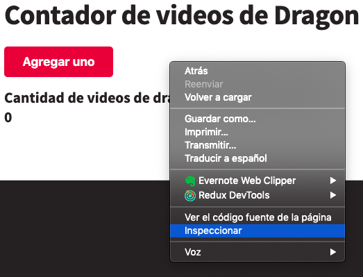
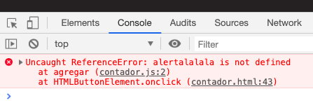

# Contador de Videos de Dragon Ball vistos en Clase


## antes que nada
`git checkout master`

`git pull `

## Desde Index, hacer click en un botón 'contador' y que vaya a la página 'contador'
Cómo se hace esto?
Nosotros, ya tenemos algo parecido en la sección 'quejas': tocamos el botón 'quejas' y
vamos a una página que se llama quejas

### Crear una página llamada 'contador.html'
Vamos a seguir el modelo de 'quejas'.



Si ustedes se fijan, quejas.html está
adentro de una carpeta que se llama 'quejas'.
Hay que crear una carpeta que se llame 'contador' y adentro un archivo que se llame 'contador.html'

Por ahora 'contador.html' puede estar vacío

### Vincular la página contador.html con el botón contador que está en index.html
Si yo toco el botón 'Quejas' voy a una página quejas.
Si yo vuelvo a la página index y toco el botón 'Contador', ¿que pasa?

Naranja

Hay que vincular el botón 'Contador' con la página contador.html

Cómo está hecho en 'Quejas' ?



Que tiene la línea donde está 'Quejas' que no tiene 'Contador'?

Prueben, y cuando hagan click en 'Contador' y vayan a una página en blanco quiere decir que lo lograron.

## Ponerle contenido a la página contador
Así como está, la página contador está en blanco. Vamos a meterle algo. Para eso, lo más fácil es copiar todo lo que está en la página 'quejas.html' y pegárselo a 'contador.html'

Cuando hagan esto van a ver que la página 'contador.html' se ve igual a 'quejas.html'. Vamos a cambiar varias cosas

### Sacar la foto del bebé
No queremos más bebés llorones en esta página.
Para esto hay que borrarle una línea a contador.html

Una sola línea

Cual línea? tiene la palabra 'image' (imagen en inglés). También tiene la palabra 'bebe'.
Está arriba del titulo

### Cambiar el título
Hay que encontrar cual es el título y cambiarlo a 'Contador de videos de Dragon Ball vistos en clase'

Pistas: No confundir con el menú. El lugar indicado tiene la palabra titulo en la misma línea..........

### Volar un par de cosas y modificar lo que sirve
* Hay que eliminar el texto que dice: 'Su opinión, para nosotros, es tan vital como el rocío de la mañana que cae.'

* Hay que eliminar esa 'area de texto' gigante que estaba ahí para escribir la queja.

* Nosotros necesitamos un botón que diga 'Agregar Uno'. Para eso vamos a cambiarle el texto al botón que dice 'Enviar'

* En vez de 'Su queja' vamos a necesitar que diga 'Cantidad de videos de dragon ball vistos en clase:'

* En vez de 'Queja de prueba' vamos a hacer que diga '0' (el número 0)

* Lo último: si se fijan en el menú, el botón 'Quejas' va a estar en rojo. Eso es por que en la línea 27 el botón tiene esta clase `class="current" `. Nosotros queremos que el botón 'Contador' esté en rojo, entonces tenemos que *cortar*  `class="current" ` y pegárselo a la línea siguiente.

Miren cómo quedó. Ya está todo listo para hacerlo andar. Si no les salió lo último no se preocupen

## Uniendo el html con el js

### Crear el archivo 'contador.js'
Fíjense en la carpeta quejas. Adentro hay un archivo más, que se llama 'quejas.js'.

Nosotros vamos a seguir ese modelo y vamos a crear un archivo que se llame 'contador.js' adentro de la carpeta 'contador'
Por ahora puede quedar el archivo vacío.

Fíjense en el archivo 'contador.html'
Abajo de todo hay una línea que 'incluye' al archivo 'quejas.js'.



En vez de esto nosotros queremos que incluya al archivo que recién creamos: 'contador.js'


# Fin de la primera parte, Comienzo de la segunda


Si hacemos click en 'Agregar Uno' no pasa nada.

De nuevo, tenemos que hacer algo parecido a lo que hicimos en 'quejas'.

Vamos a investigar como está hecho en la página quejas.
Quejas tiene esta línea:

```html
    <button onclick="enviar()">Enviar</button>
```

`onclick="enviar()"` significa que 'cuando se haga click' se va a ejecutar la función 'enviar'

Donde está la función enviar? En el archivo 'quejas.js'

Esta es la función quejas:( le borré todos los comentarios para que se lea mas fácil):
```js
function enviar() {
    var textoQueja = document.getElementById('input-quejas').value

    var textoModificado = textoQueja.replace(/a|e|o|u/gi, 'i');

    document.getElementById('lugar-burla').innerHTML = textoModificado
}
```

Cuando se toca el botón 'Enviar' todo lo que está entre `{ ` y `}` se va a ejecutar

Nosotros, en contador.js tenemos que crear una función que se llame 'agregar'
 ```js
function agregar() {

}
```
y en contador.html, en el botón 'Agregar uno' tenemos que hacer que ejecute la función 'agregar'.

Pista: `onclick="agregar()"`

pruébenlo.

### y???

todavía no pasa nada por que entre `{` y  `}` no hay nada.
vamos a meterle algo adentro a ver que pasa

Entre `{` y  `}` vamos a agregarle
```js
    alert('hola amigo')
```

Anda? No anda?? para ver si aparece algún error no se olviden de abrir la consola del Chrome:

Hacer click derecho en la página y poner inspeccionar



y click en la pestaña 'Console'



en el caso de esta imagen el error es por que en vez de `alert` puse `alertalalala`

# Una Variable


Vamos a crear una variable. Una variable es como una caja que puede guardar diferentes cosas adentro. Por ejemplo puede tener un número y después le podemos guardar un número diferente. Se llama *variable* por que lo que tiene adentro puede *variar*

Nosotros vamos a crear una variable para guardar la cantidad de videos de Dragon Ball que se vieron en la clase.

La creamos así:
```js
    var cantidadDeVideos
    cantidadDeVideos = 0
```

`var cantidadDeVideos` crea una variable. Una variable se crea una sola vez

`cantidadDeVideos = 0` guarda adentro de esa variable el número 0

a donde la ponemos? justo al principio del archivo quejas.js

Cuando se ejecute la función 'agregar' nosotros queremos guardarle a la variable un número nuevo.

Si tenía 0, queremos guradarle uno más que 0, si tenía 22 le queremos guardar uno más que 22.

Si quisiéramos restarle 8 haríamos lo siguiente:

```js
var cantidadDeVideos
cantidadDeVideos = 0

function agregar() {
    cantidadDeVideos = cantidadDeVideos - 8
    alert('hola amigo')
}
```

En este caso a 'cantidadDeVideos' le guardamos adentro cantidad de videos menos 8.

Cómo será para, en vez de restarle ocho, sumarle uno ???

Para ver si funcionó en vez de que cada vez que se ejecuta la función agregar salga una alerta que diga  'hola amigo' vamos a hacer que haga algo más útil. Que en vez de 'hola amigo' alerte la *cantidadDeVideos*.

Pista: va sin comillas

Prueben el botón Agregar un par de veces. Se va sumando uno cada vez que lo aprieto?

Pista: si no sale primero

* fijarse que todo esté escrito bien. No es lo mismo poner `alert` que `alErt`.
* fijarse en la consola si les marca un error en rojo

# La última frontera


En vez de que tire un alert hay que hacer que cambie el número que aparece en la página.
Otra vez, en quejas.js esto se hacía de una forma parecida:

```js
    document.getElementById('lugar-burla').innerHTML = textoModificado
```

Que quiere decir esto?

Esa línea agarra el elemento que tiene el id `lugar-burla` y le pone el texto que estaba guardado en la variable `textoModificado`

¿Que `id` tiene el elemento que nosotros queremos reemplazar ?

¿Cual es el nombre de la variable que guarda lo que le queremos meter a ese elemento ?

Pista: La línea de código que le tienen que agregar al final de la función 'agregar' va a ser muy parecida a la que estaba en quejas, pero con el nombre de la variable modificado

# Final
Les salió?

No les salió?

Es todo parte del entrenamiento.


